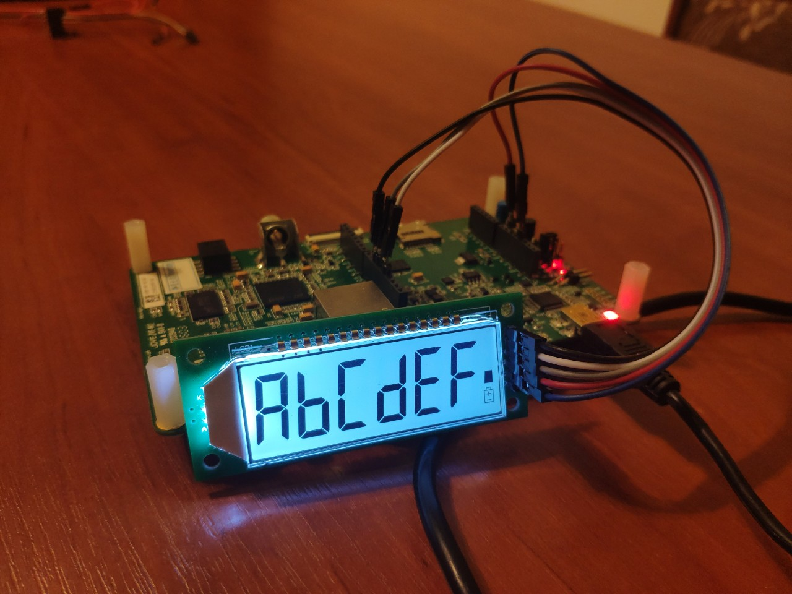
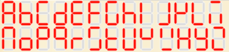

# HT1621 7 segment LCD library
Library for 7-segment lcds based on the HT1621 driver. Very often marked as PDC-6X1.



Based on the bitbanging efforts by [anxzhu](https://github.com/anxzhu) (2016-2018).
APIs rewritten in 2018 to follow the LiquidCrystal format by [valerio\new]
(https://github.com/5N44P).

Refactored. Removed dependency on any MCU hardware. Added SPI support and text support.
By Viacheslav Balandin
https://github.com/hedgehogV/HT1621-lcd


## APIs reference

* `HT1621(pPinSet *pCs, pPinSet *pSck, pPinSet *pMosi, pPinSet *pBacklight)`
Ctor. Starts the lcd with the pin assignement declared. The backlight pin is optional

* `HT1621(pInterface *pSpi, pPinSet *pCs, pPinSet *pBacklight)`
Starts the lcd with SPI interface. CS and backlight pins are optional. Tested with CPOL=LOW, EDGE=1

* `void clear()`
Clears the display

* `void backlightOn()`
Turns on the backlight

* `void backlightOff()`
Turns off the backlight

* `void batteryLevel(tBatteryLevel level)`
Accepts values from 0 to 3. Smaller values will be treated like 0, bigger values will be treated as 3. 0 turns off the battery symbol. Values from 1 to 3 will be represented by the rectangles above the battery symbol.

* `void print(const char *str)`
Print string (up to 6 characters)
Allowed characters: capital letters, digits, space, minus. Not allowed characters will be displayed as spaces.
See characters appearence in `Internal functioning` chapter

* `void print(int32_t num)`
Prints a signed integer between -99999 and 999999. Larger and smaller values will be displayed as -99999 and 999999

* `void print(float num, int precision)`
Prints a float with 0 to 3 decimals, based on the `precision` parameter. Default value is 3

* `void displayOff()`
Turns off the display (doesn't turn off the backlight)

* `void displayOn()`
Turns the display back on after it has been disabled by `noDisplay()`

## API usage

To start display you have to call one of Ctors with pointers to toggle_Gpio or SpiTx functions.
You may need a function wrapper. Wrapper example:

```cpp
// spi wrapper
void SpiTx(uint8_t *ptr, uint8_t size)
{
  HAL_SPI_Transmit(&hspi2, ptr, size, 2000);
}

// cs wrapper
void toggle_CS(bool b)
{
  HAL_GPIO_WritePin(CS_GPIO_Port, CS_Pin, b? GPIO_PIN_SET:GPIO_PIN_RESET);
}

// ctor call example
HT1621 lcd = HT1621(&SpiTx, &toggle_CS);

// prints "hello" on display
lcd.print("HELLO");
```


## Internal functioning

Letters example. Source: https://www.dcode.fr/7-segment-display
Some of them looks a bit strange. But 7-segment display isn't
the best thing to show letters



° -> 0x33 = 10 + 20 + 01 + 02
C -> 0x1D = 10 + 01 + 04 + 08

```
  ___10___
 |        |
 01       20
 |___02___|
 |        |
 04       40
 |___08___|

```

