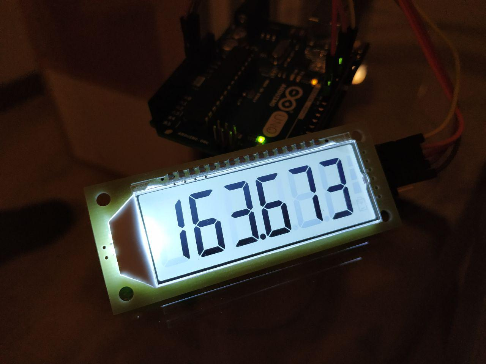

# HT1621 7 segment LCD library
Library for 7-segment lcds based on the HT1621 driver. Very often marked as PDC-6X1.



Based on the bitbanging efforts by [anxzhu](https://github.com/anxzhu) (2016-2018).
APIs rewritten in 2018 to follow the LiquidCrystal format by [valerio\new]
(https://github.com/5N44P).

Refactored. Removed dependency on any MCU hardware by Viacheslav Balandin
https://github.com/hedgehogV/HT1621-lcd


## APIs reference

* `HT1621(pPinSet *pCs, pPinSet *pSck, pPinSet *pMosi, pPinSet *pBacklight)`
Ctor. Starts the lcd with the pin assignement declared. The backlight pin is optional

* `void clear()`
Clears the display

* `void backlightOn()`
Turns on the backlight

* `void backlightOff()`
Turns off the backlight

* `void batteryLevel(tBatteryLevel level)`
Accepts values from 0 to 3. Smaller values will be treated like 0, bigger values will be treated as 3. 0 turns off the battery symbol. Values from 1 to 3 will be represented by the rectangles above the battery symbol.

* `void print(int32_t num)`
Prints a signed integer between -99999 and 999999. Larger and smaller values will be displayed as -99999 and 999999

* `void print(float num, int precision)`
Prints a float with 0 to 3 decimals, based on the `precision` parameter. Default value is 3

* `void displayOff()`
Turns off the display (doesn't turn off the backlight)

* `void displayOn()`
Turns the display back on after it has been disabled by `noDisplay()`


## Internal functioning

° -> 0x33 = 10 + 20 + 01 + 02
C -> 0x1D = 10 + 01 + 04 + 08

```
  ___10___
 |        |
 01       20
 |___02___|
 |        |
 04       40
 |___08___|

```

